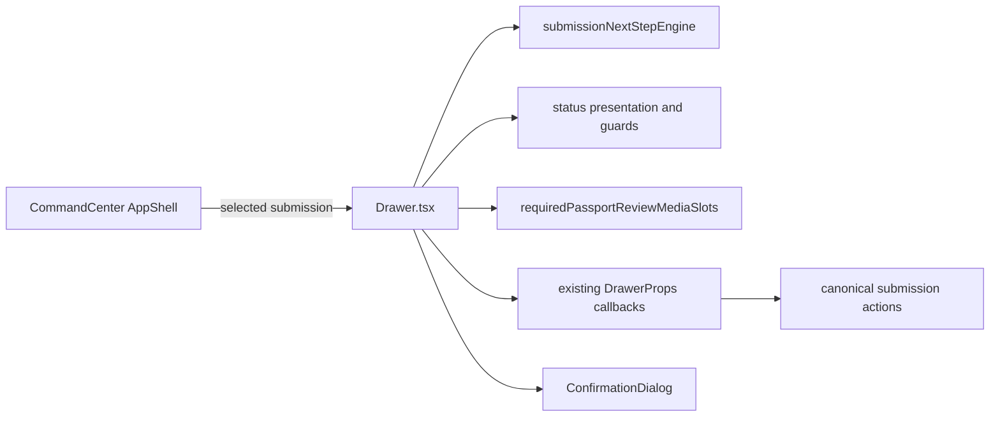

# Agent Drawer Upgrade Design

## Decisions

- Presentation derives from existing canonical contracts; no lifecycle logic is duplicated in the Drawer.
- `Drawer.tsx` keeps four tabs and its public props.
- Readiness uses `requiredPassportReviewMediaSlots`.
- `ready_for_export` resubmission reuses `ConfirmationDialog` and existing `onAction(..., "submit_for_review")`.
- Overlay isolation is owned by `CommandCenter.tsx`: AppShell is inert while Drawer is open; Drawer is mounted outside that subtree.
- Drawer-local transient state owns active tab, per-tab scroll, confirmation visibility, live announcement and recoverable UI errors.
- CSS activates `.v19-submission-drawer-*` structure and adds only `.v19-agent-drawer-*` scoped rules using existing variables.

## Component flow

## Presentation model

`Drawer.tsx` derives a local, read-only presentation model:

- `status`: existing status presentation.
- `owner`: next-step owner, with terminal `exported` displayed as none.
- `nextStep`: `buildSubmissionNextStepBrief`.
- `blocker`: existing canonical guard reason or next-step blocker.
- `questionnaire`: `agentQuestionnaireStatusPresentation`.
- `requiredMedia`: slot coverage from `requiredPassportReviewMediaSlots`.

No value is persisted and no domain type is expanded.

## Interaction design

### Primary actions

- `draft`: `Начать работу`; calls existing `save_progress`.
- `in_progress`: `Отправить на проверку`; disabled reason comes from canonical guard.
- `returned`: `Отправить исправления`; existing issue guard remains authoritative.
- read-only/terminal: `Открыть историю`; switches to History without mutation.

### Ready for export

- Primary behavior remains History/awaiting state.
- Secondary `Вернуть на проверку` opens `ConfirmationDialog`.
- Cancel label: `Оставить готовой к выгрузке`.
- Confirm label: `Вернуть на проверку`.
- Confirm calls existing `submit_for_review`; pending disables repeat; failure keeps the dialog and offers retry; success announces and closes.

### Read-only

- Questionnaire labels use `Смотреть анкету`.
- Upload/edit controls are absent when the existing presentation guard denies editing.
- Navigation remains available.

### Focus and layering

- AppShell receives `inert` and `aria-hidden` while Drawer is open.
- Drawer remains a sibling outside the inert subtree.
- Confirmation remains inside the overlay layer while the main Drawer surface becomes inert.
- Existing focus trap/return behavior is preserved and covered by tests.

### Scroll and target recovery

- One ref map stores `scrollTop` per tab.
- Leaving a tab records its scroll; entering restores it after render.
- Missing focus/deep-link targets produce a dismissible status message instead of silent failure.

## Responsive design

- Desktop: side Drawer uses existing max width and structured header/body/footer.
- Mobile: full-height sheet with a visible drag handle, horizontally scrollable tab row, single-column content, stacked actions and at least 44 px touch targets.
- No body-level overflow masking; long labels use wrapping/min-width rules.

## Failure and concurrency

- Submission id is captured for every async action.
- Late results for another selected submission do not write Drawer-local feedback.
- Pending refs prevent duplicate uploads/actions.
- Failed commands preserve canonical submission state and expose retry.
- Concurrent unrelated `CommandCenter.tsx` hunks are preserved; only the AppShell/Drawer mount boundary is changed.

## Verification

- Focused unit tests cover seven statuses, compatibility mapping, readiness slots, action confirmation, issue lifecycle, duplicate/late/retry/isolation and accessibility semantics.
- Playwright covers four tabs, seven safe fixtures, desktop/mobile, overflow, touch targets, confirmation, read-only controls, focus/inert and browser errors.
- Fixed Before/After screenshots use the same fixtures, viewport, theme, zoom and scroll position.
- Independent reviewer applies the fixed weighted rubric to both phases.

## Alternatives rejected

- New Drawer-specific state machine: rejected because canonical domain commands already own transitions.
- New route/deep link: rejected as out of scope.
- Full Drawer rewrite or new UI library: rejected to preserve ownership, behavior and bundle surface.
- Hiding tabs on mobile: rejected because the four-tab information architecture is approved.
