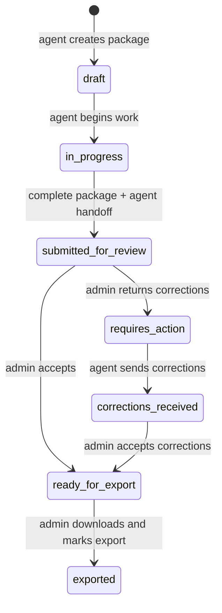

# Agent → Admin review handoff design

## Canonical state ownership

`applyAgentSubmitForReviewResult` is the agent handoff adapter: it may prepare
an owned draft as `in_progress` before applying the canonical review action.
The visible drawer still presents `Начать работу` in a draft because that is the
clear screen-level transition before work begins.

## Decision table: agent handoff

| Condition at `Отправить на проверку`         | Agent CTA                            | Canonical action       | Administrator consequence                      |
| -------------------------------------------- | ------------------------------------ | ---------------------- | ---------------------------------------------- |
| Required file or field missing               | disabled / navigates to missing work | none                   | no queue item                                  |
| Invalid trip range                           | disabled with reason                 | none                   | no queue item                                  |
| Passport extraction is processing            | enabled                              | `submitted_for_review` | review queue shows passport processing context |
| OCR unavailable or unconfirmed, no conflict  | enabled                              | `submitted_for_review` | admin verifies passport manually               |
| Unresolved OCR/questionnaire conflict        | disabled / opens conflict            | none                   | no queue item                                  |
| Critical passport/PDF/questionnaire mismatch | disabled / opens reconciliation      | none                   | no queue item                                  |
| Complete and consistent                      | enabled                              | `submitted_for_review` | normal review                                  |

## Choke points

- `src/modules/submissions/status.ts` is the central action policy and must
  enforce missing-work, passport, conflict, identity, and date conditions.
- `src/modules/submissions/passportExtractionGuards.ts` classifies raw
  passport signals for an action. Agent handoff excludes pending OCR review;
  admin acceptance retains full passport verification.
- `src/modules/submissions/submissionNextStepEngine.ts` chooses the visible
  primary action. It may prioritize agent handoff only when conflict and
  critical identity checks are clear.
- `src/modules/submissions/operationalWorkflow.ts` must delegate to the same
  policy so a direct domain call cannot bypass a visible restriction.
- `src/components/Drawer.tsx` renders the decision and the document checklist
  on `Обзор`; it does not invent a separate business rule.

## Evidence mapping

| Requirement                                            | Proof                                                                                                                                             |
| ------------------------------------------------------ | ------------------------------------------------------------------------------------------------------------------------------------------------- |
| Draft absent from agent actions                        | `tests/e2e/v19-create-submission-family-proof.spec.ts`                                                                                            |
| Pending OCR does not dead-end a complete package       | `tests/e2e/v19-real-passport-ocr-proof.spec.ts`                                                                                                   |
| Direct policy preserves hard conflicts/identity blocks | `tests/unit/operationalWorkflow.spec.ts`, `tests/unit/submissionNextStepEngine.spec.ts`                                                           |
| Real local UI path from creation to review queue       | `tests/e2e/app-smoke.spec.ts`; it must visibly refuse local originals in the administrator workspace                                              |
| Whole UI lifecycle through acceptance and export       | isolated Supabase sandbox E2E with protected Storage originals, canonical readback, and cleanup; blocked until the sandbox descriptor is assigned |
| Responsive primary action                              | screenshots at 320/390/768/1440 from the passport handoff E2E                                                                                     |

## Production boundary

The local UI flow has no authority to prove Supabase persistence, protected
Storage, or RLS. It must not be made to accept a `local-dev` original merely to
make an end-to-end test pass. The server-side `review_handoff` validation also
remains a separate follow-up: the current generic save RPC must gain
action-specific enforcement before it can be called a complete production
security boundary.
