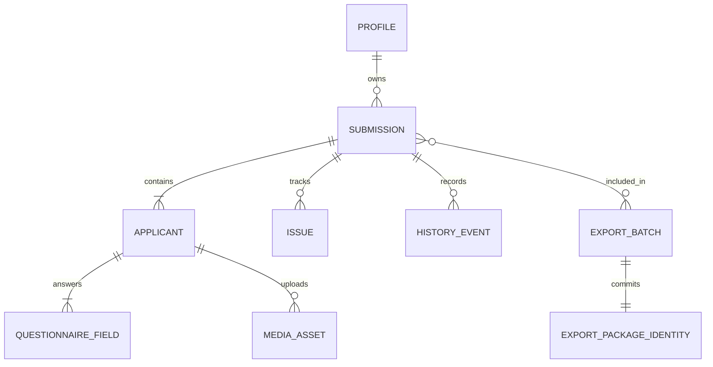
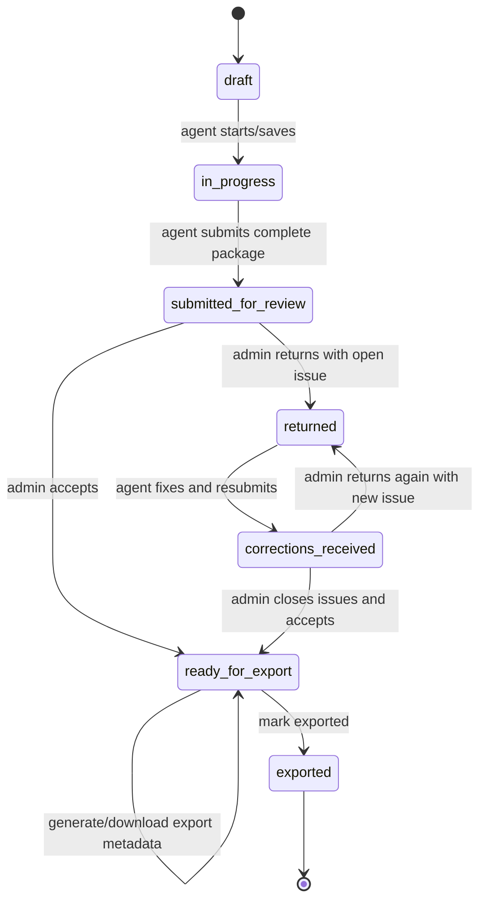
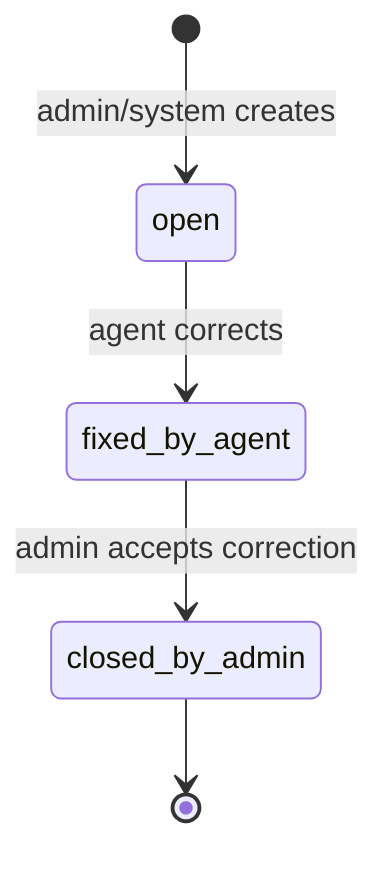

# VisaFlow V-19 UI Screen / Model Schema

Status: UI handoff schema
Source truth: `docs/release/canonical-domain-contract.md`, `docs/architecture/v19-flow-state-model.md`, `src/modules/submissions/types.ts`

## Scope

V-19 is submission-first. `Submission` is the only top-level operational entity. Applicants, questionnaire, media, issues, history, OCR/PDF review state, and export state are children or projections of a submission.

Do not add primary CRM, People, Families, Groups, analytics dashboard, board view, saved filters, legal promise screens, or multi-country selection.

Do not add standalone `Входящие` screens. Agent work events belong in `Мои действия`; admin intake/corrections work belongs in tabs/states inside `Проверка`.

## Screens

| Screen | Role | Purpose | Primary models | Required UI states |
|---|---|---|---|---|
| Access gate | agent/admin | Local/demo or Supabase login and role-safe entry. | `Profile`, `Role`, `AccessRequest` | unauthenticated, pending request, denied, loading, auth error |
| `Мои действия` | agent | Prioritized next actions across owned submissions. | `Submission`, `Issue`, `SubmissionFile`, readiness selectors | empty, search no-results, blocked, due-today, ready, disabled-with-reason |
| `Мои подачи` | agent | Owned submission registry grouped by operational need. | `Submission`, `Applicant`, readiness, status | all/progress/review/action/done filters, family/single grouping, no-results |
| Create submission drawer | agent | Create `single` or `family` draft for Spain. | `SubmissionDraft`, `Applicant`, `PreliminaryIntakeDraft`, `PassportUploadDraft` | empty draft, dirty draft, upload pending/failed, OCR advisory, save disabled reason |
| Submission drawer | agent/admin | One role-safe detail surface for a selected submission. | `Submission`, `Applicant`, `QuestionnaireSection`, `SubmissionFile`, `Issue`, `HistoryEvent` | overview, applicants, questionnaire, files, issues, history, blocked actions |
| `Проверка` | admin | Review queue, corrections queue, acceptance/return work. | `Submission`, `AdminTriageRadar`, `Issue`, readiness selectors | review tab, corrections tab, ready tab, empty queue, drawer open, action blocked |
| Admin review drawer | admin | Review questionnaire/media, create issues, accept or return. | `Submission`, `Applicant`, `Issue`, `TextIntakeReview`, `PassportExtractionReviewState` | issue composer, media review, OCR/PDF advisory, accept blocked, return blocked |
| `Выгрузка` | admin | Excel package selection, preview, generation, download, export commit. | `ExportPlan`, `ExportContractRow`, `ExportPackageIdentity`, `ExportBatch` | not ready, ready, file generated, downloaded, marked exported, mobile 4-step flow |
| Settings | agent/admin | Account/session/demo settings and admin access requests. | `Profile`, `Role`, local preferences, `AccessRequest` | clean, dirty, save success, save error, access request queue |

## Core Models

| Model | Owner | Key fields | Notes |
|---|---|---|---|
| `Profile` | auth/data | `id`, `email`, `role`, `displayName` | Role is server-owned in Supabase mode. |
| `Submission` | domain | `id`, `type`, `status`, `country=ES`, `agentId`, `applicants`, `files`, `issues`, `history`, `exportPackage` | Main operational object. |
| `Applicant` | submission child | `id`, `role`, `fullName`, `sections`, media ownership | Family members stay inside submission. |
| `QuestionnaireSection/Field` | applicant child | `fieldId`, `value`, `required`, `reviewState`, `reviewSource` | OCR/PDF values are advisory until confirmed. |
| `SubmissionFile` / `MediaAsset` | applicant/submission child | `type`, `status`, `uploadStatus`, `reviewStatus`, `storagePath` | Canonical types: `passport_scan`, `selfie`, `selfie_2`. |
| `Issue` | submission child | `status`, `severity`, `target`, `message`, `createdBy`, `fixedAt` | Blocking issues stop acceptance/export. |
| `HistoryEvent` | submission child | actor, source, from/to status, timestamp | UI timeline only; domain commands own state changes. |
| `ExportPlan` | derived | selected submissions, blockers, warnings, row model | Preview and workbook must share rows. |
| `ExportPackageIdentity` | export command | fingerprint, idempotency key, file name, row count | Required before marking exported. |
| `ExportBatch` | durable export | package identity, generated/downloaded/committed metadata | Terminal commit moves submissions to `exported`. |

## Relationships



## Status Machines

Submission lifecycle:



Issue lifecycle:



Export state:

```text
not_ready -> ready -> file_generated -> file_downloaded -> marked_exported
```

Media file status:

```text
missing | uploaded | needs_replacement | pending_review | accepted
```

Questionnaire status:

```text
empty | partial | complete | needs_fix
```

Questionnaire review:

```text
reviewState: confirmed | needs_review
reviewSource: manual | passport_ocr | family_shared | pdf_reconciliation
```

OCR/passport extraction:

```text
idle -> selected -> uploaded -> extracting -> ready
idle/selected/uploaded/extracting -> failed
unavailable is a terminal helper-disabled state
```

## Screen To Model Matrix

| Screen | Reads | Writes / commands | Must not do |
|---|---|---|---|
| `Мои действия` | derived agent task queue from submissions/issues/files | open drawer, navigate to tab, no lifecycle mutation by itself | persist `requiresAction` |
| `Мои подачи` | owned submissions, applicants, readiness | open drawer, start create drawer | mutate status directly |
| Create drawer | draft applicant/intake/media state | `createDraft`, draft save, file upload | submit for review without complete package |
| Submission drawer agent | submission detail, files, issues | edit allowed fields, upload/replace file, mark issue fixed, submit/resubmit | admin issue closure or export actions |
| `Проверка` | submitted/corrections/ready queues, triage radar | select queue tab, open review drawer | expose agent-only submission registry as admin primary nav |
| Admin review drawer | questionnaire/media/issues/readiness | `returnWithIssues`, `acceptSubmission`, `closeIssue` | accept while `open` or `fixed_by_agent` blocker exists |
| `Выгрузка` | ready submissions, export blockers, row model, history | generate workbook, download, mark exported | export non-ready or mismatched package identity |
| Settings | profile/session/preferences/access requests | save preferences, approve access where allowed | client-side role escalation |

## UI Handoff Requirements

- Every CTA must map to one of: domain command, drawer/tab navigation, file upload, export artifact action, or disabled-with-reason.
- Every disabled primary action needs visible reason text, not only disabled styling.
- Status labels must use canonical statuses, with legacy aliases normalized before display where possible.
- `requiresAction` is a derived badge/filter only; it must not appear as persisted lifecycle status.
- OCR/PDF fields must show source and review state when used in questionnaire UI.
- Export preview and generated workbook must use the same row model.
- Mobile export keeps its own 4-step interaction but reads the same `ExportPlan`.
- Admin top-level navigation is `Проверка`, `Выгрузка`, and operational settings only; correction work is a tab/state inside `Проверка`.
- Agent top-level navigation is `Мои действия`, `Мои подачи`, and settings/create.

## UI Delivery Order

1. Stabilize shared shell/navigation and status tokens.
2. Finish `Мои действия` and `Мои подачи` as agent source screens.
3. Finish shared Submission drawer with role-safe tabs/actions.
4. Finish `Проверка` and Admin review drawer.
5. Finish `Выгрузка` desktop and mobile export flow.
6. Polish Settings/access states only after operational screens are stable.
