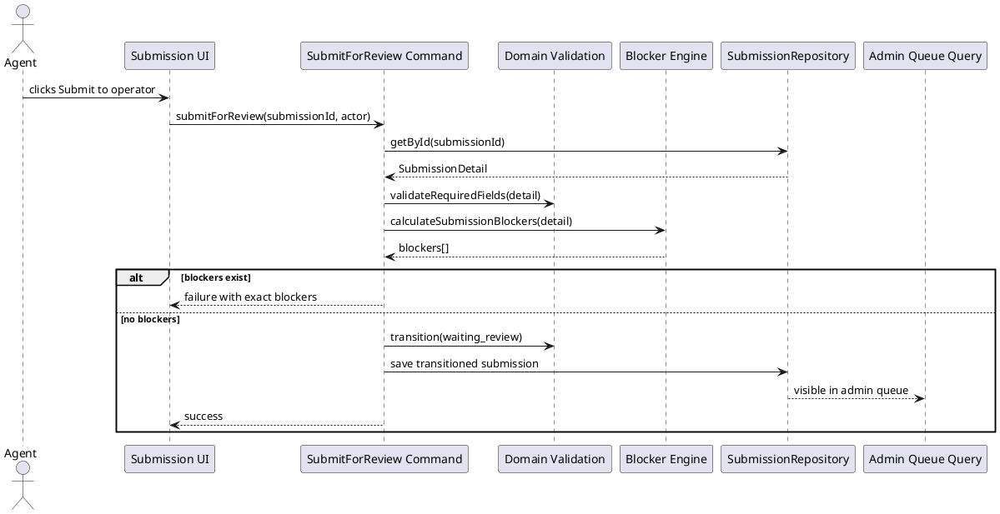
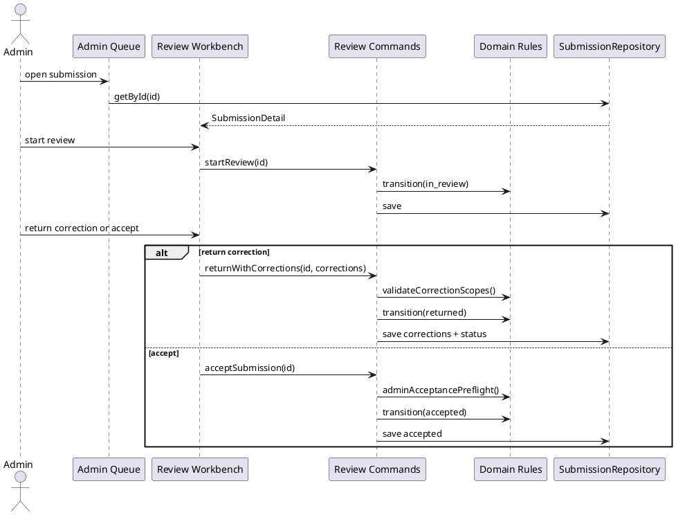
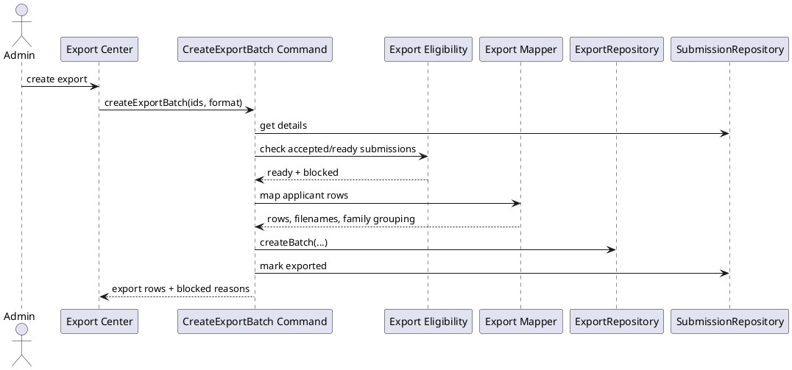

# VisaFlow AI Codex Architecture

## Chosen Architecture

Use clean architecture with a modular frontend implementation.

The application should be organized around domain rules, use cases, repository interfaces, infrastructure adapters, and feature UI. UI components must not contain business rules or persistence details.

```text
Feature UI
→ use case / command layer
→ domain validation, status transitions, blocker calculation
→ repository interfaces
→ local/mock adapter now
→ Supabase adapter later
```

The current repository already has useful domain and service assets in:

- `src/types/domain.ts`
- `src/lib/workflow.ts`
- `src/services/localRepository.ts`
- `src/services/exportService.ts`
- `src/services/submissionService.ts`
- `src/services/storageService.ts`
- `src/lib/supabase/*`
- `supabase/migrations/20260611000000_visaflow_mvp_foundation.sql`

Codex should migrate incrementally. Do not rewrite the app in one large pass. Preserve working logic while moving toward the target boundaries below.

## Target Folder Structure

```text
src/
  app/
    App.tsx
    routes.tsx
    providers/
      AppProviders.tsx
      AuthProvider.tsx
      RepositoryProvider.tsx

  domain/
    agents/
      agent.types.ts
    submissions/
      submission.types.ts
      submission.constants.ts
      submission.statusMachine.ts
      submission.validation.ts
      submission.blockers.ts
      submission.readiness.ts
    applicants/
      applicant.types.ts
      applicant.validation.ts
      applicant.status.ts
    media/
      media.types.ts
      media.constants.ts
      media.validation.ts
      media.filenames.ts
    corrections/
      correction.types.ts
      correction.validation.ts
      correction.rules.ts
    exports/
      export.types.ts
      export.mapping.ts
      export.eligibility.ts
    appointments/
      appointment.types.ts
      appointment.statusMachine.ts
    shared/
      domainErrors.ts
      result.ts

  application/
    commands/
      createSubmission.ts
      addApplicant.ts
      updateApplicant.ts
      uploadMedia.ts
      submitForReview.ts
      startReview.ts
      returnWithCorrections.ts
      acceptSubmission.ts
      markReadyForExcel.ts
      createExportBatch.ts
      updateAppointmentStatus.ts
    queries/
      listAgentSubmissions.ts
      listAdminQueue.ts
      getSubmissionDetail.ts
      listExportBatches.ts

  features/
    auth/
    agent-dashboard/
    admin-dashboard/
    submission-editor/
    review-workbench/
    export-center/
    appointment-panel/

  shared/
    ui/
      AppShell/
      Sidebar/
      Topbar/
      StatusChip/
      QueueCard/
      SubmissionCard/
      FamilyMemberCard/
      ApplicantDetailPanel/
      FormSection/
      MediaUploadCard/
      CorrectionPanel/
      ExcelExportPanel/
      AppointmentStatusPanel/
      EmptyState/
      ErrorState/
      LoadingState/
      ConfirmationModal/
    lib/
      dates.ts
      ids.ts
      csv.ts
      invariant.ts
    config/
      tokens.ts
      copy.ts
    styles/
      globals.css

  infrastructure/
    repositories/
      SubmissionRepository.ts
      MediaRepository.ts
      ExportRepository.ts
      AppointmentRepository.ts
      LocalSubmissionRepository.ts
      SupabaseSubmissionRepository.ts
    storage/
      LocalMediaStorage.ts
      SupabaseMediaStorage.ts
    supabase/
      client.ts
      config.ts
      database.types.ts
      mappers.ts
    mock/
      seed.ts
      localStorageDriver.ts

  test/
    builders/
    fixtures/
    setup/
```

### Migration Rule

During migration, Codex may keep compatibility barrels from old files:

```text
src/types/domain.ts       → re-export target domain types temporarily
src/lib/workflow.ts       → re-export target domain functions temporarily
src/services/*.ts         → call repository interfaces or adapters
```

Delete compatibility layers only after the full app and tests no longer import them.

## Module Boundaries

### Domain

Owns:

- Type-safe constants and enums.
- Submission lifecycle.
- Applicant status.
- Media status.
- Required fields.
- Validation.
- Blocker calculation.
- Readiness calculation.
- Correction invariants.
- Family grouping rules.
- Export eligibility and row mapping.

Must not import:

- React.
- Browser APIs.
- Local storage.
- Supabase.
- CSS.
- UI components.

### Application / Use Cases

Owns orchestration:

- Calls domain rules.
- Enforces role permission checks.
- Calls repositories.
- Applies status transitions.
- Returns command results for UI.

Must not contain visual rendering.

### Repositories

Own data access contracts:

- `SubmissionRepository`
- `MediaRepository`
- `ExportRepository`
- `AppointmentRepository`
- Optional `AuditEventRepository`

Interfaces live separately from implementations.

### Infrastructure

Owns implementation details:

- Local storage.
- Mock seed data.
- Supabase client.
- Supabase row mappers.
- File storage adapters.
- Export file creation helpers if they touch browser APIs.

### Feature UI

Owns screens and interactions:

- Agent dashboard.
- Submission editor.
- Family overview.
- Review workbench.
- Export center.
- Appointment panel.

UI calls use cases, not repositories directly.

### Shared UI

Owns presentation-only components:

- AppShell.
- Cards.
- Chips.
- Panels.
- Form primitives.
- Empty/error/loading states.
- Confirmation modal.

Shared UI must stay domain-agnostic where possible.

## Domain Model

### Agent

```ts
export interface Agent {
  id: string;
  email: string;
  displayName: string;
  organizationName: string | null;
  role: Role;
  createdAt: string;
}

export const ROLE = {
  AGENT: "agent",
  ADMIN: "admin",
} as const;

export type Role = (typeof ROLE)[keyof typeof ROLE];
```

### Submission

Use the product term Tourist in UI. Keep existing internal `"single"` support until all current code is safely migrated.

```ts
export const SUBMISSION_TYPE = {
  TOURIST: "tourist",
  SINGLE_LEGACY: "single",
  FAMILY: "family",
} as const;

export type SubmissionType =
  | typeof SUBMISSION_TYPE.TOURIST
  | typeof SUBMISSION_TYPE.SINGLE_LEGACY
  | typeof SUBMISSION_TYPE.FAMILY;

export interface Submission {
  id: string;
  agentId: string;
  type: SubmissionType;
  title: string;
  country: string;
  city: string;
  status: SubmissionStatus;
  familyGroupId?: string;
  familyGroupColor?: string;
  readinessPercent: number;
  createdAt: string;
  submittedAt?: string;
  reviewStartedAt?: string;
  acceptedAt?: string;
  exportedAt?: string;
  updatedAt: string;
}
```

### Submission Detail

```ts
export interface SubmissionDetail {
  submission: Submission;
  applicants: Applicant[];
  corrections: Correction[];
  appointment?: AppointmentRecord;
  exportHistory: ExportBatch[];
  timeline: StatusHistoryItem[];
}
```

### Applicant

```ts
export interface Applicant {
  id: string;
  submissionId: string;
  fullName: string;
  birthDate: string;
  citizenship: string;
  address: string;
  phone: string;
  email: string;
  passportNumber: string;
  passportIssuedAt: string;
  passportExpiresAt: string;
  country: string;
  city: string;
  tripDates: string;
  hotelName: string;
  hotelAddress: string;
  employment?: string;
  tripPurpose?: string;
  status: ApplicantStatus;
  createdAt: string;
  updatedAt: string;
}
```

### MediaAsset

```ts
export const MEDIA_TYPE = {
  PHOTO_WHITE: "photo_white",
  SELFIE: "selfie",
  VIDEO: "video",
} as const;

export const MEDIA_STATUS = {
  NO_FILE: "no_file",
  UPLOADED: "uploaded",
  REPLACE_REQUIRED: "replace_required",
  POOR_QUALITY: "poor_quality",
  ACCEPTED: "accepted",
} as const;

export interface MediaAsset {
  id: string;
  submissionId: string;
  applicantId: string;
  type: MediaType;
  status: MediaStatus;
  originalFileName?: string;
  generatedFileName?: string;
  storagePath?: string;
  mimeType?: string;
  sizeBytes?: number;
  uploadedAt?: string;
  reviewedAt?: string;
  reviewedBy?: string;
}
```

### Correction

```ts
export const CORRECTION_SCOPE = {
  SUBMISSION: "submission",
  APPLICANT: "applicant",
  FIELD: "field",
  MEDIA: "media",
} as const;

export interface Correction {
  id: string;
  submissionId: string;
  applicantId?: string;
  scope: CorrectionScope;
  fieldKey?: ApplicantFieldKey;
  mediaType?: MediaType;
  reason: string;
  severity: "blocking" | "note";
  status: "open" | "fixed" | "closed";
  createdBy: string;
  createdAt: string;
  fixedAt?: string;
}
```

Correction invariants:

- `reason` is always required.
- Field correction requires `applicantId` and `fieldKey`.
- Media correction requires `applicantId` and `mediaType`.
- Blocking open corrections prevent acceptance.
- Notes may remain open without blocking acceptance.

### ExportBatch

```ts
export interface ExportBatch {
  id: string;
  createdBy: string;
  createdAt: string;
  format: "csv" | "xlsx";
  rowCount: number;
  submissionIds: string[];
}

export interface ExportBatchItem {
  id: string;
  batchId: string;
  submissionId: string;
  applicantId: string;
  rowIndex: number;
}
```

### AppointmentRecord

```ts
export interface AppointmentRecord {
  id: string;
  submissionId: string;
  status: AppointmentStatus;
  city: string;
  date?: string;
  time?: string;
  operatorComment?: string;
  updatedBy: string;
  updatedAt: string;
}
```

## Status Model

### Submission Status

```ts
export const SUBMISSION_STATUS = {
  DRAFT: "draft",
  FILLING: "filling",
  READY_FOR_REVIEW: "ready_for_review",
  WAITING_REVIEW: "waiting_review",
  IN_REVIEW: "in_review",
  RETURNED: "returned",
  ACCEPTED: "accepted",
  READY_FOR_EXCEL: "ready_for_excel",
  EXPORTED: "exported",
  SENT_TO_APPOINTMENT: "sent_to_appointment",
  APPOINTMENT_SCHEDULED: "appointment_scheduled",
  ATTENTION_REQUIRED: "attention_required",
  COMPLETED: "completed",
} as const;
```

### Applicant Status

```ts
export const APPLICANT_STATUS = {
  QUESTIONNAIRE_EMPTY: "questionnaire_empty",
  QUESTIONNAIRE_PARTIAL: "questionnaire_partial",
  QUESTIONNAIRE_COMPLETE: "questionnaire_complete",
  MEDIA_MISSING: "media_missing",
  WAITING_REVIEW: "waiting_review",
  NEEDS_FIX: "needs_fix",
  ACCEPTED: "accepted",
} as const;
```

### Appointment Status

```ts
export const APPOINTMENT_STATUS = {
  NOT_STARTED: "not_started",
  SENT_TO_APPOINTMENT: "sent_to_appointment",
  APPOINTMENT_SCHEDULED: "appointment_scheduled",
  ATTENTION_REQUIRED: "attention_required",
  COMPLETED: "completed",
} as const;
```

### Centralized Transition Rules

The lifecycle is:

```text
draft
→ filling
→ ready_for_review
→ waiting_review
→ in_review
→ returned OR accepted
→ ready_for_excel
→ exported
→ sent_to_appointment
→ appointment_scheduled OR attention_required
→ completed
```

Allowed transitions should be represented as a const map:

```ts
export const ALLOWED_SUBMISSION_TRANSITIONS: Record<
  SubmissionStatus,
  readonly SubmissionStatus[]
> = {
  draft: ["filling"],
  filling: ["ready_for_review"],
  ready_for_review: ["waiting_review"],
  waiting_review: ["in_review", "returned"],
  in_review: ["returned", "accepted"],
  returned: ["filling", "ready_for_review", "waiting_review"],
  accepted: ["ready_for_excel"],
  ready_for_excel: ["exported"],
  exported: ["sent_to_appointment"],
  sent_to_appointment: ["appointment_scheduled", "attention_required", "completed"],
  appointment_scheduled: ["attention_required", "completed"],
  attention_required: ["sent_to_appointment", "appointment_scheduled", "completed"],
  completed: [],
};
```

The transition function must:

- Validate the transition exists.
- Check role permission.
- Check domain preconditions.
- Set timestamps.
- Update appointment status when entering appointment stages.
- Create status history.
- Return a new immutable object.

## Data Flow

### Agent Submit Flow



### Admin Review Flow



### Export Flow



## Repository Interfaces

### SubmissionRepository

```ts
export interface AdminQueueFilters {
  status?: SubmissionStatus | "all";
  agentId?: string;
  country?: string;
  city?: string;
  type?: SubmissionType | "all";
  search?: string;
}

export interface CreateSubmissionInput {
  agentId: string;
  type: SubmissionType;
  title: string;
  country: string;
  city: string;
}

export type SubmissionPatch = Partial<
  Pick<
    Submission,
    | "title"
    | "country"
    | "city"
    | "status"
    | "familyGroupId"
    | "familyGroupColor"
    | "readinessPercent"
  >
>;

export interface SubmissionRepository {
  listByAgent(agentId: string): Promise<Submission[]>;
  listForAdmin(filters: AdminQueueFilters): Promise<Submission[]>;
  getById(id: string): Promise<SubmissionDetail | null>;
  create(input: CreateSubmissionInput): Promise<Submission>;
  update(id: string, patch: SubmissionPatch): Promise<Submission>;
  submitForReview(id: string): Promise<Submission>;
  startReview(id: string): Promise<Submission>;
  accept(id: string): Promise<Submission>;
  returnWithCorrections(
    id: string,
    corrections: CorrectionInput[],
  ): Promise<Submission>;
}
```

### ApplicantRepository

```ts
export interface ApplicantRepository {
  addApplicant(input: CreateApplicantInput): Promise<Applicant>;
  updateApplicant(id: string, patch: ApplicantPatch): Promise<Applicant>;
  removeApplicant(id: string): Promise<void>;
  listBySubmission(submissionId: string): Promise<Applicant[]>;
}
```

### MediaRepository

```ts
export interface UploadMediaInput {
  submissionId: string;
  applicantId: string;
  type: MediaType;
  file: File | Blob;
  originalFileName: string;
}

export interface MediaRepository {
  upload(input: UploadMediaInput): Promise<MediaAsset>;
  markAccepted(mediaId: string): Promise<MediaAsset>;
  requestReplacement(mediaId: string, reason: string): Promise<MediaAsset>;
  listByApplicant(applicantId: string): Promise<MediaAsset[]>;
}
```

### ExportRepository

```ts
export interface ExportBatchInput {
  submissionIds: string[];
  format: "csv" | "xlsx";
  rows: ExportRow[];
  createdBy: string;
}

export interface ExportRepository {
  createBatch(input: ExportBatchInput): Promise<ExportBatch>;
  listBatches(): Promise<ExportBatch[]>;
}
```

### AppointmentRepository

```ts
export interface AppointmentRepository {
  getBySubmission(submissionId: string): Promise<AppointmentRecord | null>;
  updateStatus(input: UpdateAppointmentStatusInput): Promise<AppointmentRecord>;
}
```

## API / Use Case Contracts

Use case functions should return typed results. Do not throw for expected business rule failures.

```ts
export type CommandResult<T> =
  | { ok: true; value: T; warnings?: string[] }
  | { ok: false; error: DomainError; blockers?: Blocker[] };

export interface ActorContext {
  userId: string;
  role: Role;
  agentId?: string;
}
```

Required commands:

```ts
createSubmission(input, actor): Promise<CommandResult<Submission>>
addApplicant(input, actor): Promise<CommandResult<Applicant>>
updateApplicant(input, actor): Promise<CommandResult<Applicant>>
uploadMedia(input, actor): Promise<CommandResult<MediaAsset>>
submitForReview(submissionId, actor): Promise<CommandResult<Submission>>
startReview(submissionId, actor): Promise<CommandResult<Submission>>
returnWithCorrections(input, actor): Promise<CommandResult<Submission>>
acceptSubmission(submissionId, actor): Promise<CommandResult<Submission>>
markReadyForExcel(submissionId, actor): Promise<CommandResult<Submission>>
createExportBatch(input, actor): Promise<CommandResult<ExportPlan>>
updateAppointmentStatus(input, actor): Promise<CommandResult<AppointmentRecord>>
```

## Centralized Validation

Required applicant fields:

```ts
export const REQUIRED_APPLICANT_FIELDS = [
  "fullName",
  "birthDate",
  "citizenship",
  "address",
  "phone",
  "email",
  "passportNumber",
  "passportIssuedAt",
  "passportExpiresAt",
  "country",
  "city",
  "tripDates",
  "hotelName",
  "hotelAddress",
] as const;
```

Validation functions:

```ts
validateApplicantRequiredFields(applicant): ValidationIssue[]
validateSubmissionInvariants(detail): ValidationIssue[]
validateCorrectionInput(correction): ValidationIssue[]
validateMediaState(asset): ValidationIssue[]
validateExportEligibility(detail): ValidationIssue[]
```

Validation must produce field-level keys for UI rendering:

```ts
export interface ValidationIssue {
  code: string;
  message: string;
  scope: "submission" | "applicant" | "field" | "media" | "export";
  submissionId?: string;
  applicantId?: string;
  fieldKey?: ApplicantFieldKey;
  mediaType?: MediaType;
  blocking: boolean;
}
```

## Centralized Blocker Calculation

The blocker engine converts validations and open corrections into actionable blockers.

```ts
export interface Blocker {
  code: string;
  message: string;
  scope: "submission" | "applicant" | "field" | "media" | "export";
  applicantId?: string;
  fieldKey?: ApplicantFieldKey;
  mediaType?: MediaType;
  severity: "blocking" | "note";
}
```

Rules:

- Missing required fields block agent submission.
- Missing required media blocks agent submission.
- Missing passport number blocks media filename generation and agent submission.
- Open blocking corrections block admin acceptance.
- Uploaded media is acceptable for agent handoff.
- Accepted media is required for admin acceptance.
- Family submissions may be created with zero applicants, but cannot be submitted until at least one applicant exists and all included applicants are ready.
- Tourist/single submissions must have exactly one applicant before submission.
- Accepted submissions cannot have open blocking corrections.
- Export only includes accepted or ready-for-excel submissions.

## Storage Model

MVP may use local/mock persistence, but the model must remain Supabase-ready.

### Local / Mock Storage

Use a local adapter with:

- Seed data in `infrastructure/mock/seed.ts`.
- Local storage driver in `infrastructure/mock/localStorageDriver.ts`.
- Mappers between domain objects and persisted JSON.
- Stable IDs.
- Migration version key, for example `visaflow.localSubmissions.v2`.

Local persistence must survive reload for MVP demo flows.

### Future Supabase Tables

The current migration already defines a useful foundation. Target tables:

- `profiles` / `agents`
- `submissions`
- `applicants`
- `media_assets`
- `corrections`
- `export_batches`
- `export_batch_items`
- `appointment_records` / `appointments`
- `audit_events` / `status_history`

Rules:

- Do not mix domain model and database row model.
- Create mappers in `infrastructure/supabase/mappers.ts`.
- Keep RLS policy assumptions explicit.
- Store file paths behind a storage abstraction.
- Use signed URLs for private media access in production.
- Keep export generation behind a repository or service boundary.

## Auth and Security Assumptions

### MVP

- Mock/local email login is allowed.
- Role selection is acceptable only for dev/demo mode.
- Actions must check role in application/use case logic.
- Admin routes must not render for agent role.
- Agents must not see other agents’ submissions.
- Export actions require admin role.
- Media acceptance requires admin role.
- Appointment status updates require admin role.
- Returned corrections can be viewed by the owning agent.

### Future Production

- Supabase Auth.
- RLS policies.
- Private Supabase Storage.
- Signed media URLs.
- Server-side export generation for sensitive files.
- Audit log for status changes and corrections.
- Role-based access control at database and application levels.

## Export Architecture

Export has three layers:

1. Eligibility.
2. Row mapping.
3. File generation.

### Eligibility

```ts
export function getExportBlockers(detail: SubmissionDetail): Blocker[];
```

A submission is export-eligible when:

- Status is `accepted` or `ready_for_excel`.
- There are no open blocking corrections.
- Required media are accepted.
- Family metadata is present for family submissions.
- Passport numbers exist for all applicants.

### Row Mapping

```ts
export interface ExportRow {
  agentName: string;
  agentEmail: string;
  submissionId: string;
  submissionType: string;
  submissionTitle: string;
  applicantId: string;
  fullName: string;
  passportNumber: string;
  phone: string;
  email: string;
  country: string;
  city: string;
  tripDates: string;
  hotelName: string;
  hotelAddress: string;
  photoWhiteFileName: string;
  selfieFileName: string;
  videoFileName: string;
  submissionStatus: SubmissionStatus;
  applicantStatus: ApplicantStatus;
  appointmentStatus: AppointmentStatus;
  familyGroupId: string;
  familyGroupColor: string;
}
```

Rules:

- One row equals one applicant.
- Family rows stay adjacent.
- Preserve `familyGroupId`.
- Preserve `familyGroupColor`.
- The row mapper must be deterministic and unit tested.
- UI should display blocked submissions separately from exportable submissions.

### File Generation

MVP can start with CSV generation from rows.

XLSX generation can be added behind `ExportRepository` only with a justified dependency and tests.

## Media Architecture

Each applicant requires exactly three media slots:

```text
photo_white
selfie
video
```

Filename rules:

```text
{passportNumber}_photo_white.jpg
{passportNumber}_selfie.jpg
{passportNumber}_video.mp4
```

Rules:

- Passport number must be sanitized consistently.
- Missing passport number blocks submit and export.
- Uploaded media is not accepted media.
- Only operators can mark media accepted.
- Replacement requests should create or update a media-scoped correction.
- Storage paths should include submission ID, applicant ID, media type, and generated filename.
- UI should show the exact media slot needing attention.

## UI Architecture

The UI should be built from stable primitives:

```text
AppShell
Sidebar
Topbar
RoleSwitch
SearchBar
StatusChip
QueueCard
SubmissionCard
FamilyMemberCard
ApplicantDetailPanel
FormSection
MediaUploadCard
CorrectionPanel
ExcelExportPanel
AppointmentStatusPanel
EmptyState
ErrorState
LoadingState
ConfirmationModal
```

### Visual Direction

Use premium dark operational cockpit tokens:

```ts
export const tokens = {
  bgBase: "#07080A",
  bgElevated: "#0F131A",
  bgCard: "#11161E",
  bgCardSoft: "#171C25",
  border: "rgba(255,255,255,.10)",
  borderStrong: "rgba(255,255,255,.16)",
  text: "#F6F1E8",
  textSoft: "#B8AFA2",
  textMuted: "#858E9B",
  gold: "#F2C96D",
  goldDeep: "#D6A84F",
  blue: "#78A6FF",
  green: "#45C486",
  red: "#F26D6D",
  neutral: "#8A93A3",
} as const;
```

Agent accent is Gold. Admin accent is Blue.

### UI Rules

- One main meaning per card.
- Do not mix status and CTA.
- Show next action near the object.
- Show blockers near applicant/file/field.
- Agent always sees the next step.
- Operator always sees what to review first.
- Error messages are specific.
- Family is a group of people, not one giant form.
- Uploaded does not mean accepted.
- Excel/export is a separate workflow stage.

## Risks and Tradeoffs

### Current Repo Shape vs Target Architecture

The current repo has central domain utilities but not the full preferred clean folder structure. A staged migration is safer than a rewrite.

Tradeoff: compatibility barrels may temporarily look redundant, but they reduce breakage.

### `"single"` vs `"tourist"` Naming

The current code uses `"single"` while product language says Tourist.

Tradeoff: preserve `"single"` temporarily to avoid breaking current tests/data, but introduce a centralized type map and UI label map.

### Local Persistence vs Supabase

Local/mock mode is faster for MVP and safer for contractors. Supabase migration and client already exist but should remain behind adapters until auth/RLS/storage gates are verified.

Tradeoff: local mode cannot prove production security. Production activation must include RLS, signed URL, and audit tests.

### CSV vs XLSX

CSV is easier to implement and test with no heavy dependency. XLSX may be needed operationally.

Tradeoff: build row mapping and batch history first; add binary XLSX generation behind the export adapter after product confirmation.

### Media Upload in Local Mode

True browser file persistence is limited without backend/storage. Local mode can store metadata and preview state; Supabase Storage can store actual files later.

Tradeoff: MVP demo can validate workflow, but production file storage needs Supabase or backend activation.

### Premium UI vs Business Logic

A premium cockpit matters, but logic must not be faked.

Tradeoff: build shared UI system in parallel, but do not merge UI changes that bypass domain rules or repository boundaries.
