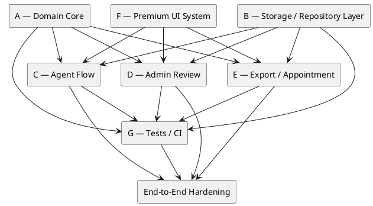

# VisaFlow AI Codex Plans

## Repository Audit

### Detected Stack

Detected from `V-19.zip`:

- Project name: `visaflow-ai-mvp`.
- Package type: ESM (`"type": "module"`).
- Frontend: React `^19.0.0`, React DOM `^19.0.0`.
- Build tooling: Vite `^7.0.0`, `@vitejs/plugin-react` `^5.0.0`.
- Language: TypeScript `^5.8.0`.
- Styling: Tailwind CSS `^3.4.17`, PostCSS, Autoprefixer, plus substantial custom CSS in `src/styles.css`.
- Backend-ready dependency: `@supabase/supabase-js` `^2.108.1`.
- Unit tests: Vitest `^4.1.8`, jsdom, Testing Library.
- E2E tests: Playwright `^1.60.0`, `@axe-core/playwright`.
- Lint/format: ESLint 9 flat config, `typescript-eslint`, Prettier.
- Custom quality scripts: performance, safety, and Codex quality radar scripts exist under `scripts/`.

### Existing Structure

Detected top-level repo items:

```text
.codex/
.env.example
AGENTS.md
docs/
eslint.config.js
index.html
package-lock.json
package.json
playwright.config.ts
postcss.config.js
prettier.config.js
scripts/
src/
supabase/
tailwind.config.js
tests/
tsconfig.app.json
tsconfig.json
tsconfig.node.json
vite.config.ts
vitest.config.ts
vitest.setup.ts
```

Detected source structure:

```text
src/
  App.tsx
  main.tsx
  styles.css
  vite-env.d.ts
  data/
    demoData.ts
  lib/
    workflow.ts
    supabase/
      client.ts
      config.ts
      database.types.ts
  services/
    aiEdgeClient.ts
    aiHelperService.ts
    authService.ts
    exportService.ts
    localRepository.ts
    profileService.ts
    statusHistoryService.ts
    storageService.ts
    submissionService.ts
  types/
    domain.ts
```

Detected test structure:

```text
tests/
  unit/
    workflow.spec.ts
  e2e/
    app-smoke.spec.ts
```

Detected Supabase structure:

```text
supabase/
  README.md
  functions/
    ai-helper/
      index.ts
  migrations/
    20260611000000_visaflow_mvp_foundation.sql
```

Detected docs/prototypes:

```text
docs/
  CODEX_OPERATING_MEMO.md
  product/
  prototypes/
  qa/
```

A separate uploaded package `VisaFlow_AI_Codex_v6_Package.zip` contains Codex prompt/reference material and an HTML prototype. It is a reference package, not the active app source.

### Reusable Assets

Reusable current repo assets:

- Domain types already exist in `src/types/domain.ts`.
- Workflow/domain helpers already exist in `src/lib/workflow.ts`, including status metadata, media slots, required applicant fields, blockers, preflight checks, status transitions, family suggestions, and filename generation.
- Local/mock persistence helpers exist in `src/services/localRepository.ts`.
- Demo seed data exists in `src/data/demoData.ts`.
- Export row planning/mapping exists in `src/services/exportService.ts`.
- Supabase client/config files exist in `src/lib/supabase/`.
- Supabase database types exist in `src/lib/supabase/database.types.ts`.
- Supabase migration exists with profiles, submissions, applicants, media assets, corrections, export batches, appointments, status history, RLS policies, and private storage bucket setup.
- Storage helpers exist in `src/services/storageService.ts`.
- Auth/profile services exist.
- Existing root `AGENTS.md` and `.codex/prompts/` provide useful operating conventions.
- Existing QA screenshots and prototypes can guide UI direction.

### Missing Pieces

Missing or incomplete relative to the target MVP:

- No `docs/codex/` folder existed before this task.
- Current source does not yet match the requested clean architecture folder layout (`src/domain`, `src/application`, `src/features`, `src/shared`, `src/infrastructure`).
- Current `src/App.tsx` appears to be a monolithic command-center/demo screen, not the full Agent/Admin workflow.
- Current UI does not yet expose all required screens: email login, agent dashboard, create submission, tourist/family forms, media upload, correction state, admin queue/detail, export panel, appointment panel.
- Current app structure does not show a dedicated design system folder; custom CSS exists but components are not yet modularized into `shared/ui`.
- Tailwind is installed and configured, but current CSS variables in `src/styles.css` do not fully align with the requested dark cockpit token set.
- Repository interfaces are not yet formalized as separate contracts from implementations.
- Supabase exists, but production activation is not complete and should remain behind adapters.
- Unit tests exist but do not yet cover every required domain area.
- E2E smoke tests exist but target the current command-center demo, not the full required MVP smoke path.

### Available Commands

Detected from `package.json`:

```bash
npm run dev
npm run build
npm run typecheck
npm run lint
npm run format
npm run format:check
npm run test
npm run test:e2e
npm run verify:performance
npm run verify:safety
npm run verify:codex-hook
npm run verify:security
npm run verify
npm run verify:full
```

Script definitions:

```json
{
  "dev": "vite --host 127.0.0.1",
  "build": "tsc -b && vite build",
  "typecheck": "tsc -b --pretty false",
  "lint": "eslint .",
  "format": "prettier . --write",
  "format:check": "prettier . --check",
  "test": "vitest run",
  "test:e2e": "playwright test",
  "verify:performance": "node scripts/verify-performance.mjs",
  "verify:safety": "node scripts/verify-safety.mjs",
  "verify:codex-hook": "node scripts/codex-quality-radar.mjs --self-test && node scripts/codex-quality-radar.mjs",
  "verify:security": "npm audit --omit=dev",
  "verify": "npm run typecheck && npm run lint && npm run verify:safety && npm run test && npm run build && npm run verify:performance",
  "verify:full": "npm run verify && npm run verify:security && npm run test:e2e"
}
```

### Risks

- The product context uses Tourist, while current code uses `"single"` for single-applicant submissions. A compatibility plan is required.
- Existing `src/App.tsx` is monolithic; a large rewrite would be risky. Split incrementally.
- Supabase migration exists, but local/mock persistence should remain the default until auth/RLS/storage verification is explicitly scoped.
- Current UI styling appears light-first, while the requested direction is premium dark cockpit.
- Existing tests are useful but too narrow for the requested workflow.
- `npm run verify:security` uses `npm audit --omit=dev`, which may require network/registry access depending on environment.
- The uploaded ZIP contains `node_modules`, `dist`, `.git`, and test results; future Codex tasks should avoid editing generated or dependency folders.
- AI helper files exist. Codex must not expand AI into decision-making, visa approval, or official verification logic.

## Open Questions

1. Should Tourist be implemented as a new internal value `"tourist"` or should the code preserve `"single"` and map it to Tourist UI copy?
2. Should the MVP UI language be fully Russian, matching existing app data/prototypes, or mixed English/Russian?
3. Should local login be email-entry only, or can role-switch demo login stay available in dev mode?
4. Should XLSX be mandatory in the first export implementation, or can CSV-compatible rows ship first?
5. Should local media upload persist actual browser files, or is metadata/mock persistence enough until Supabase Storage is activated?
6. Should appointment status stay per submission only, or be per applicant for family submissions?
7. Should AI helper files be removed, left dormant, or limited to assistive copy/summarization only?
8. Should the old command-center screen remain as a dashboard entry point during migration?
9. Should family role suggestions be part of MVP, or should family grouping be manual only?
10. Should audit/status history be shown in UI during MVP, or only stored for future observability?

## Assumptions Used

1. Preserve current `"single"` support and add a centralized UI label mapping to Tourist.
2. Use Russian operational UI copy where the current app already uses Russian, while keeping code and docs in English.
3. Keep role switching only for demo/dev; use local/mock email login as the MVP path.
4. Implement deterministic CSV-compatible export mapping first; keep XLSX behind an adapter.
5. Use local/mock media metadata until Supabase Storage activation is explicitly scoped.
6. Track appointment status at submission level for MVP.
7. Keep AI helper boundaries dormant/assistive only; no visa decisioning or official claims.
8. Preserve the current command-center screen until replacement flows are ready.
9. Allow family suggestions as assistive only; manual confirmation remains required.
10. Store status history where practical, but do not block MVP UI on full audit visualization.

## Execution Roadmap

### Phase 0 — Codex Operating Baseline

Goal: ensure all contractors/Codex runs use the same product boundary, architecture, tasks, test strategy, and branch flow.

Outputs:

- `docs/codex/*`
- Agreed branch names.
- Agreed verification commands.
- No product code changes.

### Phase 1 — Domain Core

Goal: centralize all business logic before building UI flows.

Outputs:

- Domain constants and types.
- Status machine.
- Validation functions.
- Blocker engine.
- Correction rules.
- Family rules.
- Export mapping.

This phase blocks Agent Submit, Admin Review, and Export.

### Phase 2 — Repository Layer

Goal: isolate persistence from UI and domain.

Outputs:

- Repository interfaces.
- Local/mock implementation.
- Seed data.
- Supabase-ready mappers.
- Media storage adapter interface.

This phase blocks full end-to-end flows.

### Phase 3 — Application Commands

Goal: expose typed use cases for UI.

Outputs:

- Create submission.
- Add/update applicant.
- Upload media.
- Submit for review.
- Start review.
- Return corrections.
- Accept.
- Mark ready for Excel.
- Export batch.
- Update appointment.

### Phase 4 — Agent Flow

Goal: implement agent-side intake and correction loop.

Outputs:

- Login.
- Agent dashboard.
- Create Tourist/Family.
- Applicant forms.
- Media slots.
- Blockers.
- Submit/resubmit.

### Phase 5 — Admin Review

Goal: implement operator queue and review decisions.

Outputs:

- Admin dashboard/queue.
- Filters.
- Submission detail.
- Applicant/media review.
- Correction modal/panel.
- Accept/return actions.

### Phase 6 — Export / Appointment

Goal: complete accepted-to-export-to-manual-appointment handoff.

Outputs:

- Export eligibility.
- Export rows.
- CSV download or copy-ready data.
- ZIP-ready media naming display.
- Manual appointment status panel.

### Phase 7 — Premium UI System

Goal: build cohesive dark cockpit UI without changing business rules.

Outputs:

- Tokens.
- AppShell.
- Shared components.
- Responsive layout.
- Accessibility states.

This can run in parallel after initial domain contracts exist.

### Phase 8 — Tests / CI

Goal: prevent regressions.

Outputs:

- Unit tests.
- Integration tests.
- Smoke tests.
- CI gate.
- Verification docs.

### Phase 9 — End-to-End Hardening

Goal: prove the full operational workflow.

Outputs:

- Full smoke path passing.
- Runtime QA screenshots.
- No horizontal overflow.
- Safe copy review.
- Merge/release readiness report.

## Workstreams

## Workstream A — Domain Core

Goal:

- Domain types.
- Status machine.
- Validations.
- Blocker engine.
- Correction rules.
- Family rules.
- Export mapping.

Blocks:

- Agent submit.
- Admin review.
- Export.

Recommended branch:

```text
feat/domain-core
```

Primary files/folders:

```text
src/domain/
src/types/domain.ts
src/lib/workflow.ts
tests/unit/
```

Notes:

- Start by extracting and strengthening existing logic from `src/types/domain.ts` and `src/lib/workflow.ts`.
- Keep compatibility exports while migrating.
- Add unit tests for every rule before wiring UI.

## Workstream B — Storage / Repository Layer

Goal:

- Repository interfaces.
- Local/mock implementation.
- Seed data.
- Mappers.
- Supabase-ready boundary.

Blocks:

- Full end-to-end flows.

Recommended branch:

```text
feat/storage-adapter
```

Primary files/folders:

```text
src/infrastructure/repositories/
src/infrastructure/mock/
src/infrastructure/supabase/
src/services/
src/data/demoData.ts
tests/unit/
tests/integration/
```

Notes:

- Do not activate production Supabase.
- Keep local/mock adapter as default.
- Use Supabase files as future-ready infrastructure only.

## Workstream C — Agent Flow

Goal:

- Dashboard.
- Create submission.
- Tourist/family forms.
- Media upload UI.
- Blockers.
- Submit to operator.

Depends on:

- Domain Core.
- Storage Layer.

Recommended branch:

```text
feat/agent-flow
```

Primary files/folders:

```text
src/features/auth/
src/features/agent-dashboard/
src/features/submission-editor/
src/application/commands/
src/shared/ui/
tests/e2e/
```

Notes:

- Agent must only see own submissions.
- Agent submit must use domain blockers.
- Returned corrections must target exact field/file/applicant.

## Workstream D — Admin Review

Goal:

- Admin queue.
- Filters.
- Submission detail.
- Review actions.
- Corrections.
- Accept/return flow.

Depends on:

- Domain Core.
- Storage Layer.

Recommended branch:

```text
feat/admin-review
```

Primary files/folders:

```text
src/features/admin-dashboard/
src/features/review-workbench/
src/application/commands/
src/shared/ui/
tests/e2e/
```

Notes:

- Admin accept must use `adminAcceptancePreflight` equivalent.
- Admin cannot accept with open blocking corrections or unaccepted media.
- Corrections must be precise and validated.

## Workstream E — Export / Appointment

Goal:

- Export eligibility.
- CSV/XLSX-compatible rows.
- ZIP-ready naming.
- Manual appointment statuses.

Depends on:

- Accepted submissions.
- Export mapping.

Recommended branch:

```text
feat/export-flow
```

Primary files/folders:

```text
src/domain/exports/
src/domain/appointments/
src/features/export-center/
src/features/appointment-panel/
src/application/commands/
tests/unit/
tests/e2e/
```

Notes:

- Export one row per applicant.
- Keep family rows adjacent.
- Appointment status is manual only.
- Do not imply automatic booking.

## Workstream F — Premium UI System

Goal:

- Tokens.
- AppShell.
- Cards.
- Chips.
- Spacing.
- Typography.
- Responsive layout.

Can run in parallel, but must not change domain/state/storage rules.

Recommended branch:

```text
feat/premium-ui-system
```

Primary files/folders:

```text
src/shared/ui/
src/shared/config/
src/shared/styles/
src/features/*/
src/styles.css
tailwind.config.js
docs/qa/
```

Notes:

- Use requested dark cockpit tokens.
- Do not bypass domain/application logic.
- Capture screenshots for major UI changes.

## Workstream G — Tests / CI

Goal:

- Unit tests.
- Integration tests.
- Smoke checks.
- CI gates.

Recommended branch:

```text
feat/tests-and-ci
```

Primary files/folders:

```text
tests/
vitest.config.ts
playwright.config.ts
.github/workflows/
package.json
```

Notes:

- Prefer existing scripts.
- Do not weaken existing commands.
- Add CI only after local commands are clear.

## Dependency Graph



## Sequencing

Recommended sequence:

1. `feat/domain-core`
2. `feat/storage-adapter`
3. `feat/premium-ui-system` foundation
4. `feat/agent-flow`
5. `feat/admin-review`
6. `feat/export-flow`
7. `feat/tests-and-ci`
8. final hardening branch from `develop`

Rationale:

- Domain rules must be stable before UI.
- Storage boundary must exist before end-to-end flows.
- UI system can start early but must not change business logic.
- Agent/Admin/Export can proceed in parallel after Domain + Storage contracts are merged.
- Tests/CI should expand continuously but finalize after core flows exist.

## Branch Order

```text
main
develop
feat/domain-core
feat/storage-adapter
feat/premium-ui-system
feat/agent-flow
feat/admin-review
feat/export-flow
feat/tests-and-ci
hardening/e2e-mvp
```

## Parallelizable Tasks

After `feat/domain-core` is merged:

- Storage repository interfaces and local adapter.
- Premium UI tokens and AppShell.
- Domain test expansion.

After `feat/storage-adapter` is merged:

- Agent dashboard and editor.
- Admin queue and review shell.
- Export center shell.
- Playwright smoke scaffolding.

After Agent/Admin/Export shells exist:

- Correction UX.
- Media review UX.
- Appointment panel.
- Responsive QA.
- CI gate.

## Blockers

Current likely blockers for feature work:

- Domain model naming mismatch: `"single"` vs Tourist.
- No formal repository interfaces.
- App UI is monolithic.
- Required MVP screens are not yet present.
- Current tests do not cover full workflow.
- Supabase adapter must not leak into UI.
- Current CSS/design tokens do not match requested premium dark cockpit direction.
- Local media persistence model must be defined.

## Recommended Merge Order

1. Merge `feat/domain-core` first.
2. Merge `feat/storage-adapter` second.
3. Merge `feat/premium-ui-system` once it provides AppShell/tokens without changing domain.
4. Merge `feat/agent-flow` after it passes domain/use-case tests.
5. Merge `feat/admin-review` after accept/return rules are verified.
6. Merge `feat/export-flow` after export mapping tests pass.
7. Merge `feat/tests-and-ci` after it confirms all expected scripts and gates.
8. Merge `hardening/e2e-mvp` only after full smoke path passes.

## Merge Readiness Gate

Before merging any workstream:

```bash
npm run typecheck
npm run lint
npm run test
npm run build
```

For UI/runtime work:

```bash
npm run test:e2e
```

For broad/release work:

```bash
npm run verify
```

For release candidates:

```bash
npm run verify:full
```

If a command fails, report the exact command, failure summary, and remediation. Do not claim readiness.
